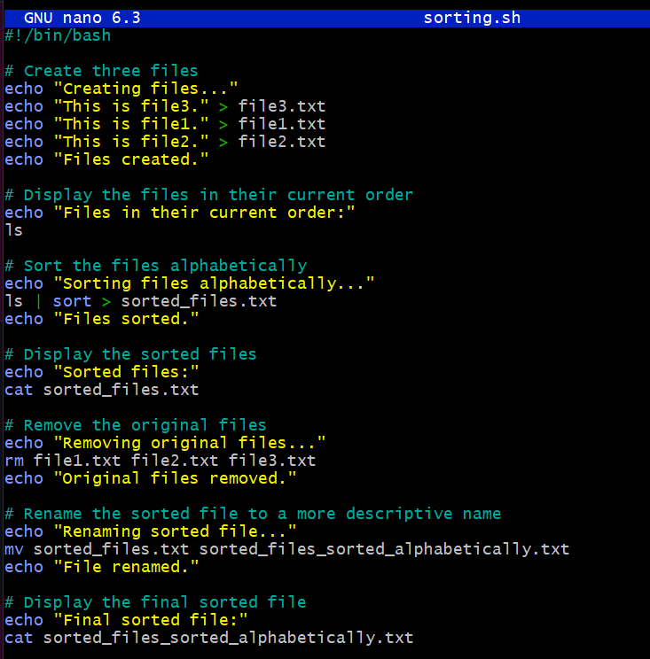
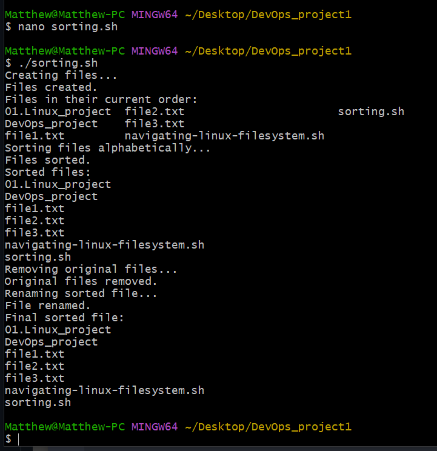

# Introduction to Shell Scripting abd User Input

Shell scripting helps us automate repetitive task. Bash scripting are essentially a series of commands and instructions that are executed sequentially in a shell. These scripts can be executed directly from the command line ot called from other scripts.

## Shell Scripting Syntax Elements

1. <b>Variables</b>: Bash allows you to define and work with variabes. Variables can store data of various types such as numbers, strings, and arrays. Variables are assigned using the = operator, and their values can be accessed using the $ before the variable name.

<b>Example:</b> Assgning value to a variable:

`name="John"`

<b>Example:</b> Retrieving value from a variable:

`echo $name`


2.  <strong>Control Flow:</strong> Bash provides control flow statements like if-else, for loops, while loops, and case statements to control the flow of execution in your scripts. These statements allow you to make decisions, interate over lists, and execute different commands bsed on conditions

<Strong>Example:</Strong> Using if-else to execute script based on a condition.

`!#/bin/bash`

`#Example script to check if a number is positive. negative, or zero
re`


<strong>Iterating through a list using a for loop</strong>

`#!/bin/bash`

`# Example script to print numbers from 1 to 5 using a for loop`

`for (( i=1; i<=5; i++ ))`

`do`

` echo $i`

`done`


3. <b>Using backtick for command substitution</b>

`` current_date=`date +%Y-%m-%d ``

<b>Example :</b> Using $() syntax for command substitution

`current_date=$(date +%Y-%m-%d)`

4. Input and Output : Bash provides various ways to handle inputs and outputs. You can use the read command to accept user input, and output text to the console using the echo command. Additionally, you can redirect input and output using operators like > (output to a file), < (input from a file), and | (pipe the output of one command as input to the other).

<b>Example :</b> Accept user input

`echo "Enter your name:"
read name
`
<b>Example: </b> Out the result of a command into a file

echo "Hello world"

<b>Example</b> : Output the result of a command into a file

`echo "hello world" > index.txt`

<b>Example</b> : Pass the result of a command as input to another command

`echo "hello world" | grep "pattern"`

5. Functions : Bash allows you to define and use functions to group related commands together. Functions provide a way to modularize your code and make it more reusable. You can define function by using the function keyword or simply by declaring the function name followed by parentheses.

`#!/bin/bash`

`# Define a function to greet the user
greet() {
    echo "Hello, $1! Nice to meet you."
}`

`# Call the greet function and pass the name as an argument`

`greet "John"`


## Let's write our first shell script

Step 1 : On your terminal, open a folder called shell scripting using the `command mkdir shell-scripting`. This will hold all the scripts that we will write in this project.


Step 2 : Create a file called user-input.sh using the command `touch user-input.sh`


Step 3 : Inside the file, copy and paste the block of code below :

`#!/bin/bash`

`# Prompt the user for their name
echo "Enter your name:"
read name`

`# Display a greeting with the entered name
echo "Hello, $name! Nice to meet you."`

The script prompts for your name. When you type your name, it displays the text hello ! Also `#!/bin/bash` helps you to specify the type of bash interpreter to be used to execute the script.

Step 4 : Save your file


Step 5 : Run the command using sudo chmod +x user-input.sh

Step 6 : Run the script using the command `./user-input.sh`


# Directory Manipulation and Navigation

Here, we will be writing a simple shell script as a way of practicing what we learnt.

This script will display the current directory, create a new directory called "my_directory", change to that direcotry, create two files inside it, list the files, move back one level up, remove the "my_directory" and finally list the files in the current directory again.

Follow the steps below to do that :

<b>Step 1</b> : Open a file named navigating-linux-filesystem.sh

<b>Step 2</b> : Paste the code block below into the file.

```#!/bin/bash

# Display current directory
echo "Current directory: $PWD"

# Create a new directory
echo "Creating a new directory..."
mkdir my_directory
echo "New directory created."

# Change to the new directory
echo "Changing to the new directory..."
cd my_directory
echo "Current directory: $PWD"

# Create some files
echo "Creating files..."
touch file1.txt
touch file2.txt
echo "Files created."

# List the files in the current directory
echo "Files in the current directory:"
ls

# Move one level up
echo "Moving one level up..."
cd ..
echo "Current directory: $PWD"

# Remove the new directory and its contents
echo "Removing the new directory..."
rm -rf my_directory
echo "Directory removed."

# List the files in the current directory again
echo "Files in the current directory:"
ls```

```
<b>Step 3 </b>: Run the command below to set execute permission on the file :

`sudo chmod +x navigating-filesystem.sh` 

<b>step 4: </b>  Run the script using the command :

`./navigating-filesystem.sh`</s>


# File Operations and Sorting

Let's write a script that creates three files (file1.txt, file2.txt, and file3.txt), displays the files in their current order, sorts them alphabetically, saves the sorted files in sorted_files.txt, displays the sorted files, remove the original files, renames the sorted file to sorted_files_sorted_alphabetically.txt, and finally displays teh contents of the final sorted file.

Lets proceed using the steps below:

<b>Step 1</b> : Open a terminal and create a file called sorting.sh 

`touch sorting.sh`


<b>step 2</b> paste the code block into the file.
~~~
#!/bin/bash

# Create three files
echo "Creating files..."
echo "This is file3." > file3.txt
echo "This is file1." > file1.txt
echo "This is file2." > file2.txt
echo "Files created."

# Display the files in their current order
echo "Files in their current order:"
ls

# Sort the files alphabetically
echo "Sorting files alphabetically..."
ls | sort > sorted_files.txt
echo "Files sorted."

# Display the sorted files
echo "Sorted files:"
cat sorted_files.txt

# Remove the original files
echo "Removing original files..."
rm file1.txt file2.txt file3.txt
echo "Original files removed."

# Rename the sorted file to a more descriptive name
echo "Renaming sorted file..."
mv sorted_files.txt sorted_files_sorted_alphabetically.txt
echo "File renamed."

# Display the final sorted file
echo "Final sorted file:"
cat sorted_files_sorted_alphabetically.txt
~~~



<b>Step 3</b> : Set execute permission on sorting.sh using the command `sudo chmod +x sorting.sh`

<b>Step 4</b>: Run your script using the command `./sorting.sh`




## WOrking with Numbers and Calculations

This script defines two variables num1 and num2 with numeric values, performs basic arithmetic operations (addition, subtraction, multiplication, division, and modulus), and displays the results. It also performs more complex calculations such as raising num1 to the power of 2 and calculating the square root of num2, and dispalys those results as well.

To perform this task:

<b>Step 1: </b> Create a file called Calculations.sh

`touch calculations.sh`


<b>step 2: </b> paste the code block below:

~~~
#!/bin/bash

# Define two variables with numeric values
num1=10
num2=5

# Perform basic arithmetic operations
sum=$((num1 + num2))
difference=$((num1 - num2))
product=$((num1 * num2))
quotient=$((num1 / num2))
remainder=$((num1 % num2))

# Display the results
echo "Number 1: $num1"
echo "Number 2: $num2"
echo "Sum: $sum"
echo "Difference: $difference"
echo "Product: $product"
echo "Quotient: $quotient"
echo "Remainder: $remainder"

# Perform some more complex calculations
power_of_2=$((num1 ** 2))
square_root=$(echo "sqrt($num2)" | bc)

# Display the results
echo "Number 1 raised to the power of 2: $power_of_2"
echo "Square root of number 2: $square_root"
~~~


<b>Step 3</b> : Set execute permission on calculations.sh using the command `sudo chmod +x calculations.sh`


<b>Step 4 </b>: Run your script using this command  `./calculations.sh`


# File Backup and Timestamping

This shell scripting example is focused on file backup and timestamp. As a DevOps Engineer backing up databases and other storage devices is one of the most common task you get to carryout. This script defines the source directory and backup directory paths. It then creates a timestamp using the current date and time, and creates a backup directory with the timestamp appended to its name. The script then copies all files from the source directory to the backup directory using the cp command with the -r option for recursive copying. Finally, it displays a message indicating the completion of the backup process and shows the path of the backup directory with the timestamp.

 Lets proceed using the steps bellow:

 <b>Step 1:</b> On your terminal open a file backup.sh

 `touch backup.sh`

 <b>Step 2:</b> Copy and paste the code block below into the file.

~~~
 #!/bin/bash

# Define the source directory and backup directory
source_dir="/tmp/source"
backup_dir="~/backup"

# Create a timestamp with the current date and time
timestamp=$(date +"%Y%m%d%H%M%S")

# Create a backup directory with the timestamp
backup_dir_with_timestamp="$backup_dir/backup_$timestamp"

# Create the backup directory
mkdir -p "$backup_dir_with_timestamp"

# Copy all files from the source directory to the backup directory
cp -r "$source_dir"/* "$backup_dir_with_timestamp"

# Display a message indicating the backup process is complete
echo "Backup completed. Files copied to: $backup_dir_with_timestamp"
~~~

 <b>Step 3:</b> Set execute permission on backup.sh using this command

 `sudo chmod +x backup.sh`

  <b>Step 4:</b> Run your script using the command 
  `./backup.sh`


